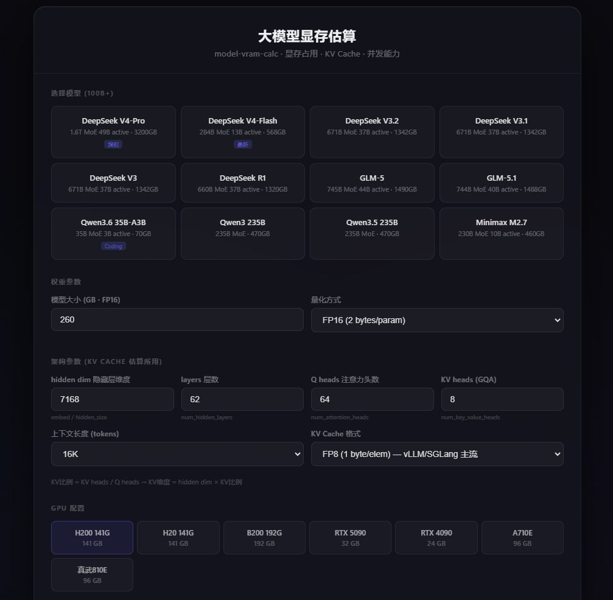

# 大模型显存估算系统

model-vram-calc — 在线估算大模型显存占用、KV Cache 与集群并发能力。

## 功能特性

- **模型权重显存** — 支持 FP16/BF16/FP8/INT8/FP4/INT4 量化压缩
- **KV Cache 估算** — 考虑 GQA 架构，兼容 FP16/FP8/INT4/FP4 格式
- **推理开销计算** — 可选 vLLM PagedAttention / SGLang / 保守估计
- **集群并发估算** — 计算最少 GPU 数量与最大并发 Session 数

## 快速开始

1. **下载** — 点击仓库右上角的 **Code** 按钮，选择 **Download ZIP** 下载压缩包。
2. **解压** — 将下载的 ZIP 文件解压到本地任意目录。
3. **打开** — 进入解压后的文件夹，双击 `index.html` 即可在浏览器中运行。

> 也可直接克隆仓库后打开：

```bash
git clone https://github.com/soongzx/model-vram-calc.git
cd model-vram-calc
open index.html        # macOS
start index.html       # Windows
xdg-open index.html    # Linux
```

## 界面预览



## 支持的模型

| 模型 | FP16 大小 | 隐藏层维度 | 层数 | 最大上下文 |
|------|---------|-----------|------|-----------|
| DeepSeek V4-Pro | 3200 GB | 7168 | 61 | 1M |
| DeepSeek V4-Flash | 568 GB | 4096 | 43 | 1M |
| DeepSeek V3.2 / V3.1 / V3 | 1342 GB | 7168 | 67 | 128K |
| DeepSeek R1 | 1320 GB | 7168 | 67 | 128K |
| GLM-5 / GLM-5.1 | 1490 / 1488 GB | 7168 | 62 | 200K |
| Qwen3.6 35B-A3B | 70 GB | 3072 | 40 | 1M |
| Qwen3 235B / Qwen3.5 235B | 470 GB | 5120 | 60 | 128K |
| Minimax M2.7 | 460 GB | 3072 | 62 | 200K |

## 支持的 GPU

| GPU | 显存 |
|-----|------|
| H200 141G | 141 GB |
| H20 141G | 141 GB (中国特供) |
| B200 192G | 192 GB |
| RTX 5090 | 32 GB |
| RTX 4090 | 24 GB |
| A710E | 96 GB (阿里 PPU) |
| 真武810E | 96 GB (阿里 PPU) |

## 计算公式

详见 [VRAM_CALC.md](./VRAM_CALC.md)。

```
单Session总显存 = 模型权重(FP16 × 量化比) + KV Cache + 推理开销
KV Cache = 2 × numLayers × hiddenDim × kvRatio × contextLen × bytesPerElem
最大并发 = floor((可用显存 - 权重显存) / (KV Cache + 开销))
```

## 技术栈

纯前端实现，无任何外部依赖。

- HTML5 + CSS3
- 原生 JavaScript
- 深色主题，响应式布局
