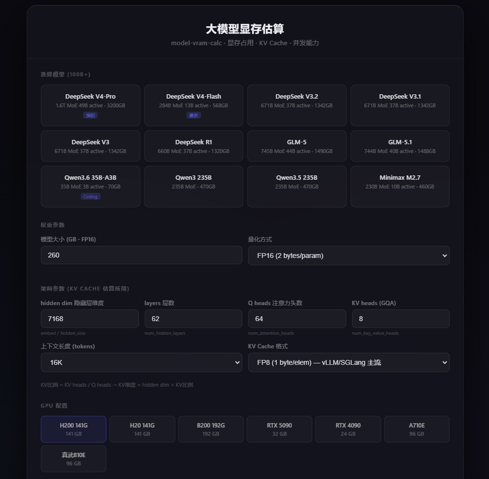

# 大模型显存估算系统

model-vram-calc — 在线估算大模型显存占用、KV Cache 与集群并发能力。

## 版本更新

### v2.0（2026-05-24）

- **体验优化**：
  - 删除「重新计算」按钮，参数变更自动计算
  - 新增计算进度动画（旋转 spinner + "正在重新计算..."提示）
  - 模式切换时自动触发计算
- **零并发告警**：并发为 0 时显示红色告警框，自动分析并列出显存不足的具体原因
- **名称修正**：保守估计 → 保守估算
- **GPU 新增**：H100 80G、H100 NVL 94G
- **标签新增**：GLM-5.1 添加 Coding 标签
- **标题补充**：模型选择区增加"数据来源 modelscope.cn"说明

### v1.9（2026-05-24）

- **参数修正（根据官方 config.json）**：
  - DeepSeek V4-Flash: `h=4096 ✓, layers=43 ✓, attnHeads 32→64, kvHeads 8→1`
  - GLM-5/5.1: `hidden_size 7168→6144, layers 62→78, kvHeads 8→64 (MHA)`
  - Qwen3.5-397B: `hidden_size 2048→4096, layers 64→60, attnHeads 8→32`
  - Minimax-M2.7: `全部参数确认正确 ✓`
- **新增 GPU**：H100 80G、H100 NVL 94G
- **新增标签**：GLM-5.1 添加 Coding 标签
- **体验优化**：删除重新计算按钮，参数变更自动计算 + 进度动画

### v1.8（2026-05-24）

- **参数修正**：根据魔搭社区官方 config.json 修正多个模型架构参数
  - DeepSeek V4-Pro: `attnHeads 64→128`
  - Qwen3-235B: 替换为 MoE 版参数 (A22B), `h: 5120→4096, layers: 60→94, kvHeads: 8→4`
  - Qwen3.5-397B: `h: 5120→2048, attnHeads: 64→8, kvHeads: 8→2`
  - Qwen3.6-35B: `h: 3072→2048, attnHeads: 48→32, kvHeads: 8→4`

### v1.7（2026-05-24）

- **新增估算模式**：保守估计 / 乐观估算
  - 保守：推理开销≥15% · 单位 1e9 · 含 8% 对齐损耗（生产容量规划）
  - 乐观：推理开销≤8% · 单位 1024³ · 理论值（理论上限参考）
- **新增模型**：Qwen3.5 397B（397B MoE 17B active）
- **修复**：删除重复的 Qwen3 235B 条目

### v1.6

- **模型权重显存** — 支持 FP16/BF16/FP8/INT8/FP4/INT4 量化压缩
- **KV Cache 估算** — 考虑 GQA 架构，兼容 FP16/FP8/INT4/FP4 格式
- **推理开销计算** — 可选 vLLM PagedAttention / SGLang / 保守估计
- **集群并发估算** — 计算最少 GPU 数量与最大并发 Session 数

## 快速开始

1. **下载** — 点击仓库右上角的 **Code** 按钮，选择 **Download ZIP** 下载压缩包。
2. **解压** — 将下载的 ZIP 文件解压到本地任意目录。
3. **打开** — 进入解压后的文件夹，双击 `index.html` 即可在浏览器中运行。

> 也可直接克隆仓库后打开：

```bash
git clone https://github.com/soongzx/model-vram-calc.git
cd model-vram-calc
open index.html        # macOS
start index.html       # Windows
xdg-open index.html    # Linux
```

## 界面预览



## 支持的模型

| 模型 | 参数量 | FP16 大小 | 隐藏层维度 | 层数 | 最大上下文 | 魔搭社区 |
|------|--------|---------|-----------|------|-----------|----------|
| DeepSeek V4-Pro | 1.6T MoE | 3200 GB | 7168 | 61 | 1M | — |
| DeepSeek V4-Flash | 284B MoE | 568 GB | 4096 | 43 | 1M | — |
| DeepSeek V3.2 / V3.1 / V3 | 671B MoE | 1342 GB | 7168 | 67 | 128K | — |
| DeepSeek R1 | 660B MoE | 1320 GB | 7168 | 67 | 128K | — |
| GLM-5 / GLM-5.1 | 745B/744B MoE | 1490/1488 GB | 7168 | 62 | 200K | — |
| Qwen3 235B | 235B MoE | 470 GB | 5120 | 60 | 128K | [链接](https://modelscope.cn/models/Qwen/Qwen3-235B) |
| Qwen3.5 397B | 397B MoE 17B active | 794 GB | 5120 | 64 | 256K | [链接](https://modelscope.cn/models/Qwen/Qwen3.5-397B-A17B) |
| Qwen3.6 35B | 35B MoE 3B active | 70 GB | 3072 | 40 | 1M | [链接](https://modelscope.cn/models/Qwen/Qwen3.6-35B-A3B) |
| Minimax M2.7 | 230B MoE | 460 GB | 3072 | 62 | 200K | — |

## 支持的 GPU

| GPU | 显存 | 类型 |
|-----|------|------|
| H200 141G | 141 GB | NVIDIA |
| H20 141G | 141 GB | NVIDIA (中国特供) |
| B200 192G | 192 GB | NVIDIA |
| RTX 5090 | 32 GB | NVIDIA |
| RTX 4090 | 24 GB | NVIDIA |
| A710E | 96 GB | 阿里 PPU (HBM2e) |
| 真武 810E | 96 GB | 阿里 PPU (HBM2e) |

## 计算公式

详见 [VRAM_CALC.md](./VRAM_CALC.md)。

```
单 Session 总显存 = 模型权重 (FP16 × 量化比) + KV Cache + 推理开销
KV Cache = 2 × numLayers × hiddenDim × kvRatio × contextLen × bytesPerElem
最大并发 = floor((可用显存 - 权重显存) / (KV Cache + 开销))
```

## 技术栈

纯前端实现，无任何外部依赖。

- HTML5 + CSS3
- 原生 JavaScript
- 深色主题，响应式布局
